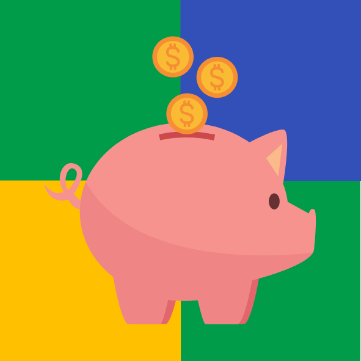
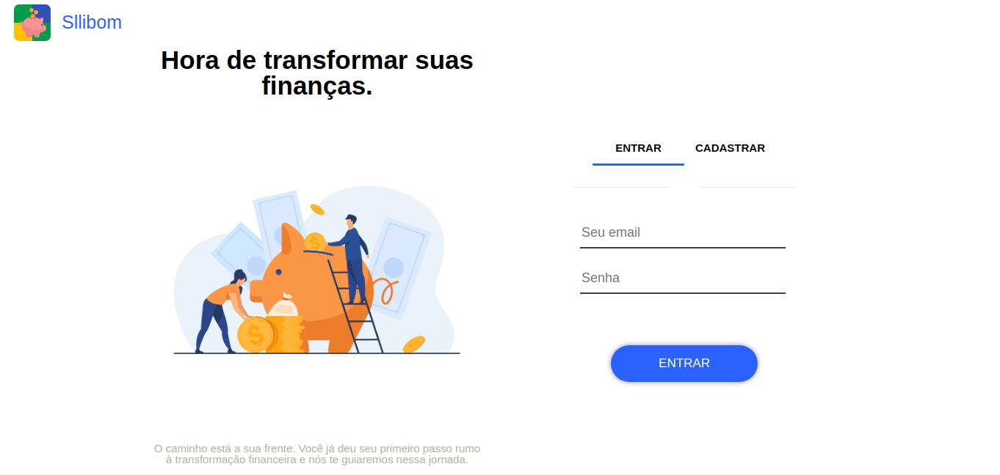
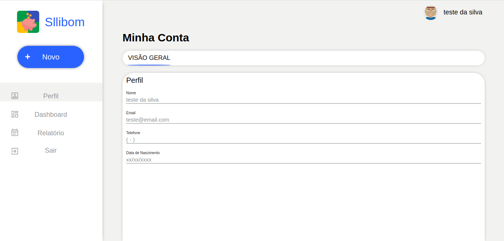
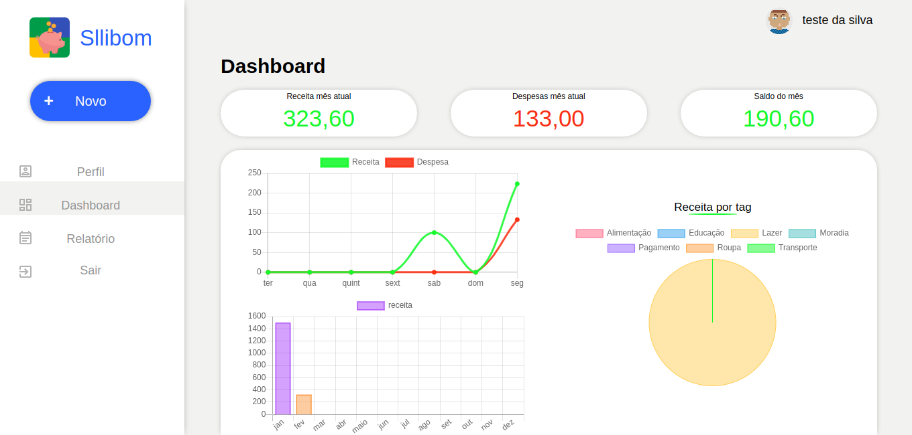
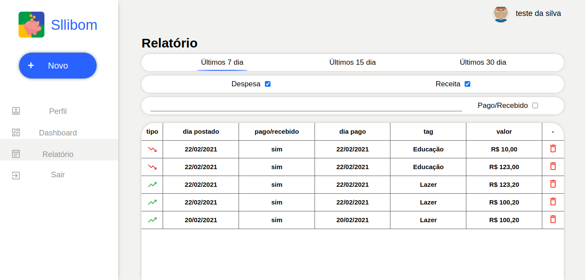
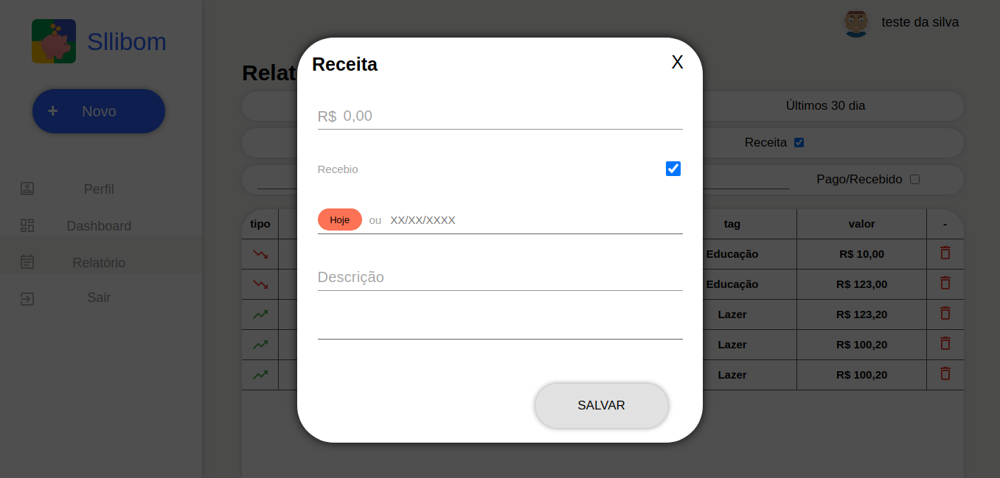

  

## Projeto

App para controlar suas receitas e despesas.

## Tecnologias

Esse projeto foi desenvolvido utilizando as seguintes tecnologias:

- [React](https://reactjs.org/)
- [Firebase](https://firebase.google.com/?hl=pt-br)
- [Material-ui](https://material-ui.com/pt/)
- [redux](https://redux.js.org/)
- [redux-saga](https://redux-saga.js.org/)
- [redux-saga-fireabse](https://redux-saga-firebase.js.org/)

## Video

  

## Imagens

- Tela 01 - Login
  

- Tela 02 - Perfil
  

- Tela 03 - Dashboard
  

- Tela 04 - Relatrio
  

- Tela 05 - Cadastro
  
